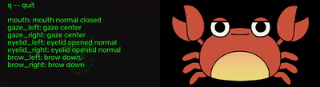

# motion mask

Скромное приложение для трансляции 2D аватара в виртуальную камеру на основе
трекинга лица.



## Оговорки

Текущая версия всё еще находится в разработке и тестировании.

В дальнейшем планируется доработать проект и документацию (в том числе инструкции по установке для
разных ОС).

## Ключевые возможности

+ Кроссплатформенность: Windows, Linux, Mac (тестируется)
+ Работает на современных встроенных графических адаптерах
+ Приложение не требует подключения к какому-либо серверу, регистрации в сервисах и т.п.
+ Возможность добавлять и использовать собственные аватары
+ Калибровка состояний лица для трекинга (учитывает особенности лица и освещения)

## Производительность

Приложение выдаёт стабильные 30 fps аватара (виртуальная камера) на ноутбуке со следующими
характеристиками:

+ OS: Debian GNU/Linux 13
+ CPU: 11th Gen Intel i5-1135G7 (8) @ 1.400GHz
+ GPU: Intel TigerLake-LP GT2 [Iris Xe Graphics]
+ Потребление памяти приложением ~400Мб
+ Потребление процессора: 25-30 % (на процессорах с поддержкой ИИ потребление должно быть заметно
  меньше, если они поддерживаются `mediapipe`)

## Недостатки и ограничения

Состояния лица выявляются модулем `mediapipe` с помощью готовой нейронной сети, настройки которой
содержатся в файле `face_landmarker.task`. Данные этого файла предположительно получены путём
обучения на выборке фотографий, где диапазон мимики был ограничен. Таким образом сложные состояния
мимики сложно детектируются модулем. К примеру, прищур одного глаза и широко открытый другой глаз
будут с большой вероятностью детектироваться нестабильно и/или некорректно.

Для лучшего результата распознавания мимики лица необходимо обеспечить качественное освещение.
Камера должна быть ровно напротив лица. Также лицо от камеры должно находиться примерно на
расстоянии вытянутой руки или ближе.

Для веб-камеры важны следующие свойства: автофокус, минимальное разрешение 1280x720.

## Архитектура решения

### Обработка фреймов

Преобразование исходных фреймов камеры в фреймы аватара происходит по следующей цепочке:

``Camera -> MediaPipe -> Model -> Avatar -> Virtual Camera``

Фреймы, получаемые из камеры, обрабатываются моделью приложения с помощью `mediapipe`.
`mediapipe` на основании каждого фрейма распознаёт лицо и выявляет некоторое число метрик.
Каждая метрика отображает то или иное положение части лица (открытость рта, глаза и т.п.).

Часть метрик от mediapipe отправляется в модель приложения и обрабатывается, определяя
совокупное состояние частей аватара. На основании состояния частей аватара путём наложения из
кусочков изображения (png файлы) создаётся фрейм аватара.

Созданный фрейм аватара затем отправляется в виртуальную камеру с помощью `pyvirtualcam`.

### Оптимизация

Для оптимизации производительности используются следующие механизмы:

+ Опция пропуска обрабатываемых фреймов (значение можно установить в файле настроек, по
  умолчанию -- 0)
+ LRU cache готовых фреймов аватара (размер по умолчанию -- 64 фрейма)

### face_landmarker.task

Файл `face_landmarker.task` уже есть в этом репозитории и необходим для опознавания лиц с
помощью `mediapipe`. Можно поэкспериментировать с более свежей версией, если она появится в
будущем.
Свежую версию возможно найти
по [ссылке](https://storage.googleapis.com/mediapipe-models/face_landmarker/face_landmarker/float16/latest/face_landmarker.task)

Совместимость версий файла `face_landmarker.task`, отличных от предлагаемой, не проверялась.

### Основные зависимости

- Python 3.12
- [mediapipe](https://github.com/google-ai-edge/mediapipe)
- [pyvirtualcam](https://github.com/letmaik/pyvirtualcam)

Полный список зависимостей находится в файле `requirements.txt`.

## Установка

Общий порядок установки:

1. Виртуальная камера (v4l2loopback / OBS / Unity Capture)
2. Python и venv
3. Приложение motion mask

### Виртуальная камера

#### OBS Virtual Camera (Windows)

Виртуальная камера OBS (в последних версиях уже встроена в дистрибутив):

+ [OBS](https://obsproject.com/)
+ [OBS Virtual Camera](https://obsproject.com/kb/virtual-camera-guide)

Для работы `mediapipe`:

+ [Visual C++ Redistributable 64bit](https://learn.microsoft.com/en-us/cpp/windows/latest-supported-vc-redist?view=msvc-170)

#### Unity Capture (Windows)

https://github.com/schellingb/UnityCapture

#### v4l2loopback (Linux)

Пример команды для установки виртуальной камеры `v4l2loopback` в Debian:

`sudo apt install v4l2loopback-dkms v4l2loopback-utils`

Инициализация виртуальной камеры производится отдельной командой перед запуском motion mask и
описана ниже.

#### Установка виртуальной камеры для Mac

Используется OBS Virtual Camera [OBS Virtual Camera](https://obsproject.com/)

### Установка приложения (Linux)

#### Проверка Python и venv

```
python3 --version
python3 -m venv --help
```

Версия Python должна быть 3.12.x или выше. Также должен быть установлен `venv`.
Если версия ниже или Python отсутствует, установите Python и `venv` предпочитаемым способом.

#### Получение кода

Путём клонирования репозитория:

```
git clone https://github.com/d0nutk3y/motion-mask.git
```

Или путём загрузки архива:

```
curl -L https://github.com/d0nutk3y/motion-mask/archive/refs/heads/main.zip -o motion-mask.zip
unzip motion-mask.zip
```

#### Создание и активация виртуального окружения

В директории с motion mask:

```
cd motion-mask
python3 -m venv .venv
source .venv/bin/activate
```

После активации приглашение командной строки изменится — появится префикс `(.venv)`.
Проверьте, что используется нужный интерпретатор:

```
which python
python --version
```

Вывод должен указывать на `.venv/bin/python` и показывать версию 3.12 или выше.

#### Установка зависимостей

Установка последних версий зависимостей:

```
pip install -r requirements.in
```

Установка зависимостей с конкретными версиями:

```
pip install -r requirements.txt
```

#### Создание .desktop- файла для скриптов запуска

Необходимо выдать желаемому скрипту права на выполнение (пример для `start-preview.sh`):

```
chmod +x start-preview.sh
```

Затем следует создать файл:

`~/.local/share/applications/motion-mask-preview.desktop`

Содержимое файла (вместо `<user>` необходимо указать конкретного пользователя):

```
[Desktop Entry]
Type=Application
Name=motion mask
Exec=/home/<user>/motion-mask/start-preview.sh
Path=/home/<user>/motion-mask
Terminal=true
Categories=AudioVideo;
```

Чтобы в меню появился новый пункт, необходимо перезайти в сессию под тем же пользователем или
воспользоваться командой:

```
update-desktop-database ~/.local/share/applications/
```

## Запуск

Если сначала запустить приложение, которое использует веб-камеру, то есть вероятность, что оно
"захватит" её в эксклюзивный режим, и motion mask не сможет получать из неё фреймы.

Последовательность запуска (Linux):

1. `start-live.sh` (сначала инициализирует `v4l2loopback`)
2. Другое приложение где планируется использовать виртуальную камеру с аватаром

Последовательность запуска (Windows):

1. `OBS Virtual Camera` или `Unity Capture`
2. `start-live.cmd` (Windows)
3. Другое приложение где планируется использовать виртуальную камеру с аватаром

### Три режима работы

Режимы `setup` и `preview` представляют собой графический интерфейс и управляется горячими
клавишами. Подсказка для горячих клавиш всегда находится на экране.

#### setup

В режиме `setup` производится калибровка аватара. Шаги калибровки можно выполнять и переделывать в
любом порядке.

Сохранение настроек осуществляется на последнем шаге при нажатии `processing`.
Настройки сохраняются в файле `settings.json`.
В файл попадут настройки только для тех калибровок, которые были сделаны до сохранения.

На первом шаге `Analytics` при нажатии `processing` запоминается состояние метрик. При следующем
нажатии `processing` состояние заново считывается и сравнивается с предыдущим, возвращая абсолютные
значения метрик и их разницу в лог консоли. Эта опция может быть полезна для более тонкой настройки
логики порогов срабатывания в коде или при ручной правке конфигурации.

#### preview

В режиме `preview` на экране отображается аватар, как он будет выглядеть в live режиме, но без
включения виртуальной камеры. Дополнительно для `preview` режима реализован мониторинг потребляемой
приложением оперативной памяти, который периодически отправляет данные в лог консоли.

#### live

В режиме `live` аватар на основе трекинга лица с веб-камеры транслируется в виртуальную камеру.
Для этого режима необходимо сначала включить виртуальную камеру, а потом уже запускать приложение.

## Запуск через командную строку

Пример команды запуска:

```
python3 main.py -m preview -d v4l2loopback -a ./avatars/kanisan
```

В зависимости от ОС вместо `python3` может быть `python`. Если в системе интерпретатор Python не
указан в переменной окружения PATH, то потребуется указать полный путь.

Описание аргументов:

```
options:
  -h, --help            show this help message and exit
  -m {setup,preview,live}, --mode {setup,preview,live}
                        Mode: setup, preview, live
  -d {v4l2loopback,obs,unitycapture}, --device {v4l2loopback,obs,unitycapture}
                        Device: v4l2loopback, obs, unitycapture
  -a path_to_avatar, --avatar path_to_avatar
                        Path to avatar
```

Для режима `live` необходимо перед запуском инициализировать (включить) виртуальную камеру.
Для Linux существует скрипт `start-live.sh`, который инициализирует `v4l2loopback`.
Для Windows требуется вручную активировать виртуальную камеру в OBS или использовать Unity Capture.

## Запуск через скрипты (bash)

Скрипты для запуска полезны тем, что в них можно сразу указать режим виртуальной камеры и путь к
директории с аватаром.

`start-setup.sh` -- запуск в режиме калибровки

`start-preview.sh` -- запуск в режиме предварительного просмотра

`start-live.sh` -- запуск в режиме `live` с предварительной активацией `v4l2loopback`. Требуется
права root (sudo). Предварительно деактивирует `v4l2loopback`, а затем запускает его снова.

## Формат аватара

Директория с аватаром должна содержать PNG-изображения с альфа-слоем в соотношении 16:9.
Разрешение изображений рекомендуется делать больше 640x360, чтобы избежать масштабирования.
Из соображений оптимизации и достаточности все изображения загружаются в память с понижением
разрешения до 640x360.

Посмотреть пример именования файлов и их содержимое возможно в директории `./avatars/kanisan`.
Имена файлов должны полностью соответствовать примеру.

## Возможные ошибки приложения и совместимости

### Ошибка при попытке использовать камеру

В логе терминала:

```
ERROR: Cannot open camera
```

Если веб-камера не была подключена, а команда `sudo modprobe v4l2loopback exclusive_caps=1` уже
была выполнена, то нулевой индекс (устройство `/dev/video0`) был получен виртуальной камерой.

Решение:

1. Отключить физическую веб-камеру
2. Выключить виртуальную камеру `modprobe -r v4l2loopback`
3. Выполнить проверку `ls /dev/ | grep video`. Не должно быть ни одного video-устройства.
4. Подключить веб-камеру

### Проблемы совместимости v4l2loopback и OBS

Возможна несовместимость версий `v4l2loopback` и OBS, которая приводит к тому, что OBS не может
использовать виртуальную камеру для вывода. Однако при этом в других приложениях виртуальная камера
будет работать корректно.

Начиная с версии `v4l2loopback` 0.14.0, модуль стал более строго соблюдать спецификацию V4L2.
OBS 30.2.3.1 пытается запустить поток, используя не совсем корректную последовательность команд,
которая раньше работала, но теперь отклоняется драйвером. Для обеспечения корректной работы OBS
рекомендуется его обновить до последней версии, где ошибка исправлена. Если по каким-либо причинам
обновить OBS нельзя, то решением может быть откат версии `v4l2loopback`.

## Арт краба

Источник:
https://yakitorichan.booth.pm/items/3170523

## Планы по разработке

### Distribution

- [ ] Сделать универсальные установщики для Windows / Linux / Mac

### Core features

- [ ] Бэкграунд для аватара и его смена
- [ ] Прозрачный бэкграунд для аватара
- [ ] Постобработка фрейма перед подачей в камеру (сглаживание, distortion, шум)

### Debug/Optimization:

- [ ] Отладка отправления фреймов в виртуальную камеру (убрать задержки по
  сравнению с тестом)

### Failsafe features:

- [ ] Улучшить обработку ошибок инициализации виртуальной камеры
- [ ] Улучшить обработку ошибок инициализации обычной камеры
- [ ] Добавить проверку подключения веб-камеры
- [ ] Избежать возможный segfault при выходе
- [ ] Лимиты на размер файлов настройки

### Settings:

- [ ] Добавить настройку номера камеры для трекинга лица
- [ ] Добавить настройку разрешения камеры
- [ ] Добавить настройку разрешения виртуальной камеры
- [ ] Добавить настройку разрешения аватара
- [ ] Добавить настройку изменения разрешения (resize)
- [ ] Добавить настройку глубины LRU cache аватара