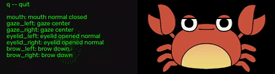

# motion-mask

## Общее

Скромное desktop-приложение для трансляции 2D-аватара в виртуальную камеру на основе
трекинга лица.



### Статус проекта

Текущая версия приложения всё еще находится в разработке и тестировании.

### Ключевые возможности

+ Кроссплатформенность: Linux, Windows, macOS (asap)
+ Производительность: Работает на современных встроенных графических адаптерах
+ Независимость: Приложение не требует подключения к какому-либо серверу, регистрации в сервисах
+ Гибкость: Возможность добавлять и использовать собственные аватары
+ Простота: Для создания своего аватара не требуется сложных навыков
+ Персональная настройка: Калибровка состояний лица для трекинга (учитывает особенности мимики)

### Распространение

Распространение осуществляется в форме архива, который содержит исполнительный файл и другие
необходимые компоненты. Благодаря использованию `Nuitka` для компиляции, приложение не требует
установки интерпретатора, настройки виртуального окружения и установки зависимостей.

Сборку из исходного кода возможно осуществить самому или взять готовую из раздела Releases.

### Производительность

Приложение транслирует аватар в виртуальную камеру (стабильные 30 fps) на ноутбуке со следующими
характеристиками:

+ OS: Debian GNU/Linux 13
+ CPU: 11th Gen Intel i5-1135G7
+ GPU: Intel TigerLake-LP GT2 [Iris Xe Graphics]

Потребление ресурсов:

+ Оперативная память приложением ~350 МБ
+ Процессор: до 30 %
+ Занимаемое место на диске: ~500 МБ

На процессорах с поддержкой ИИ потребление должно быть заметно меньше, если они поддерживаются
`mediapipe`.

### Требования к веб-камере

Для веб-камеры важны следующие параметры:

+ Автофокус
+ Минимальное разрешение 1280x720

### Недостатки и ограничения

Состояния лица выявляются модулем `mediapipe` с помощью готовой нейронной сети, настройки которой
содержатся в файле `face_landmarker.task`. Данные этого файла предположительно получены путём
обучения на выборке фотографий, где диапазон мимики лиц был ограничен. Таким образом сложные
состояния мимики сложно детектируются модулем. К примеру, прищур одного глаза и широко открытый
другой глаз при взгляде в сторону будут с большой вероятностью детектироваться нестабильно и/или
некорректно.

Для лучшего результата распознавания мимики лица необходимо обеспечить качественное освещение.
Камера должна быть ровно напротив лица. Также лицо от камеры должно находиться примерно на
расстоянии вытянутой руки или ближе.

## Архитектура решения

### Основные зависимости

- Python 3.12
- [mediapipe](https://github.com/google-ai-edge/mediapipe)
- [pyvirtualcam](https://github.com/letmaik/pyvirtualcam)
- [psutil](https://github.com/giampaolo/psutil)

Для сборки:

- [Nuitka](https://github.com/Nuitka/Nuitka)

### Обработка фреймов

Преобразование исходных фреймов камеры в фреймы аватара происходит по следующей цепочке:

``Camera -> MediaPipe -> Model -> Avatar -> Virtual Camera``

1. Фреймы, получаемые из камеры, обрабатываются моделью приложения с помощью `mediapipe`.
   На основании каждого фрейма происходит распознавание лица и выявление некоторого число метрик.
   Каждая метрика отображает то или иное положение части лица (открытость рта, глаза и т.п.).

2. Часть метрик от `mediapipe` отправляется в модель приложения и обрабатывается, определяя
   совокупное состояние частей аватара.

3. Состояние частей аватара проходит этап преобразования в целях компенсации недостатков
   модели.

4. На основании состояния частей аватара путём наложения из кусочков изображения (PNG-файлы)
   создаётся фрейм аватара.

5. Получившийся итоговый фрейм аватара отправляется в виртуальную камеру с помощью
   `pyvirtualcam`.

### Оптимизация

Для оптимизации производительности и качества используются следующие механизмы:

+ Опция пропуска обрабатываемых фреймов (значение можно установить в файле настроек, по
  умолчанию -- 0). Эта опция может помочь снизить нагрузку на слабом железе.
+ LRU cache готовых фреймов аватара (размер по умолчанию -- 128 фреймов). Кэш позволяет не собирать
  фреймы заново тем самым снижая нагрузку и задержки.

### face_landmarker.task

Файл `face_landmarker.task` уже есть в этом репозитории и необходим для опознавания лиц с
помощью `mediapipe`. Можно поэкспериментировать с более свежей версией, если она появится в
будущем.

Свежую версию возможно найти
по [ссылке](https://storage.googleapis.com/mediapipe-models/face_landmarker/face_landmarker/float16/latest/face_landmarker.task)

Совместимость версий файла `face_landmarker.task`, отличных от предлагаемой, не проверялась.

### Формат аватара

Директория с аватаром должна содержать PNG-изображения с альфа-слоем в соотношении 16:9.
Разрешение изображений рекомендуется делать больше 640x360, чтобы избежать масштабирования.
Из соображений оптимизации и достаточности все изображения загружаются в память с понижением
разрешения до 640x360.

Посмотреть пример именования файлов и их содержимое можно в директории `./avatars/kanisan`.
Имена файлов должны полностью соответствовать примеру.

Рекомендуется хранить директорию каждого аватара в директории `./avatars`.

## Установка и запуск

### Установка и первый запуск

Общий порядок установки и первого запуска:

1. Установить виртуальную камеру
2. Скачать архив с приложением для своей ОС
3. Распаковать архив в отдельную директорию
4. Сделать ярлыки для трех скриптов запуска
5. Проверить скрипты запуска для трёх режимов (устройство виртуальной камеры, путь к аватару)
6. Подключить камеру
7. Произвести калибровку в режиме `setup`, сохранить настройки
8. Проверить работу в режиме `preview`. Если что-то не устроило, произвести калибровку отдельных
   шагов заново.
9. Запустить в режиме `live` и проверить работу в приложении, которое использует виртуальную камеру

#### Виртуальная камера

Приложение поддерживает несколько видов виртуальной камеры:

+ v4l2loopback (Linux)
+ OBS (Windows и macOS)
+ Unity Capture (Windows)

##### v4l2loopback (Linux)

Пример команды для установки виртуальной камеры `v4l2loopback` в Debian:

`sudo apt install v4l2loopback-dkms v4l2loopback-utils`

Инициализация виртуальной камеры производится перед запуском приложения.
Подробнее в следующих разделах.

##### OBS Virtual Camera (Windows)

Виртуальная камера OBS (в последних версиях уже встроена в дистрибутив):

+ [OBS](https://obsproject.com/)
+ [OBS Virtual Camera](https://obsproject.com/kb/virtual-camera-guide)

Для работы `mediapipe` возможно потребуется установить:

+ [Visual C++ Redistributable 64bit](https://learn.microsoft.com/en-us/cpp/windows/latest-supported-vc-redist?view=msvc-170)

##### OBS Virtual Camera (macOS)

+ [OBS Virtual Camera](https://obsproject.com/)

##### Unity Capture (Windows)

+ [Unity Capture](https://github.com/schellingb/UnityCapture)

#### Установка приложения (Linux)

##### Получение актуальной сборки

Последняя версия сборки доступна в разделе
[Releases](https://github.com/d0nutk3y/motion-mask/releases/tag/main-latest)

##### Распаковка

Пример команды для распаковки архива со сборкой из текущей директории в директорию приложения,
которая находится в домашней директории текущего пользователя:

```
mkdir -p ~/motion-mask && tar -xzf motion-mask-linux.tar.gz -C ~/motion-mask
```

##### Создание .desktop-файла для скриптов запуска (опционально)

Чтобы .desktop-файл запускал приложение через скрипт необходимо, чтобы у скрипта были права для
выполнения (в готовых сборках это реализовано).

###### Пример создания .desktop-файла для скрипта `start-preview.sh`

Необходимо создать файл:

`~/.local/share/applications/motion-mask-preview.desktop`

Содержимое файла (вместо `<user>` необходимо указать конкретного пользователя):

```
[Desktop Entry]
Type=Application
Name=motion mask
Exec=/home/<user>/motion-mask/start-preview.sh
Path=/home/<user>/motion-mask
Terminal=true
Categories=AudioVideo;
```

Чтобы в меню появился новый пункт, необходимо перезайти в сессию под тем же пользователем или
воспользоваться командой:

```
update-desktop-database ~/.local/share/applications/
```

### Запуск

Если сначала запустить приложение, которое использует веб-камеру, то есть вероятность, что оно
"захватит" её в эксклюзивный режим. В таком случае получение фреймов из захваченной камеры будет
невозможно.

#### Последовательность запуска (Linux)

1. Любой скрипт запуска, например `start-live.sh` (сначала инициализирует `v4l2loopback`)
2. Другое приложение, где планируется использовать виртуальную камеру с аватаром

#### Последовательность запуска (Windows)

1. `OBS Virtual Camera` или `Unity Capture`
2. Любой скрипт запуска, например `start-live.cmd`
3. Другое приложение, где планируется использовать виртуальную камеру с аватаром

#### Последовательность запуска (macOS)

1. `OBS Virtual Camera`
2. Любой скрипт запуска, например `start-live.sh`
3. Другое приложение, где планируется использовать виртуальную камеру с аватаром

#### Три режима работы

Режимы `setup` и `preview` представляют собой графический интерфейс и управляется горячими
клавишами. Подсказка для горячих клавиш всегда находится на экране.

##### Режим `setup`

В режиме `setup` производится калибровка аватара. Шаги калибровки можно выполнять и переделывать в
любом порядке.

Сохранение настроек осуществляется на последнем шаге при нажатии `processing`.
Настройки сохраняются в файле `settings.json`.
В файл попадут настройки только для тех калибровок, которые были сделаны до сохранения.

На первом шаге `Analytics` при нажатии `processing` запоминается состояние метрик. При следующем
нажатии `processing` состояние заново считывается и сравнивается с предыдущим, возвращая абсолютные
значения метрик и их разницу в лог консоли. Эта опция может быть полезна для более тонкой настройки
логики порогов срабатывания в коде или при ручной правке конфигурации.

##### Режим `preview`

В режиме `preview` на экране отображается аватар, как он будет выглядеть в режиме `live`, но без
трансляции и включения виртуальной камеры.

Дополнительно для `preview` режима реализован мониторинг потребляемой приложением оперативной
памяти, который периодически отправляет данные в лог консоли.

##### Режим `live`

В режиме `live` аватар на основе трекинга лица с веб-камеры транслируется в виртуальную камеру.
Для этого режима необходимо сначала включить виртуальную камеру, а потом уже запускать приложение.

### Запуск через командную строку

Для режима `live` необходимо перед запуском инициализировать (включить) виртуальную камеру:

```
sudo modprobe -r v4l2loopback
sudo modprobe v4l2loopback exclusive_caps=1 devices=1 video_nr=9 max_buffers=2
```

Пример команды запуска приложения из его директории:

```
./motion-mask -m live -d /dev/video9 -a "./avatars/kanisan"
```

Подсказка для параметров запуска:

```
  -m, --mode MODE       application mode: setup, preview, live
  -d, --device DEVICE   virtual camera device: v4l2loopback, obs, unitycapture, /dev/video9
  -a, --avatar PATH_TO_AVATAR
                        path to avatar directory
```

Для Linux существует скрипт запуска `start-live.sh`, который инициализирует `v4l2loopback`,
и затем запускает приложение.

Для Windows требуется сначала запустить OBS или Unity Capture. И только потом запускать приложение.

### Запуск через скрипты (bash)

Скрипты для запуска полезны тем, что в них можно сразу указать режим и путь к директории с
аватаром.

`start-setup.sh` -- запуск в режиме калибровки

`start-preview.sh` -- запуск в режиме предварительного просмотра

`start-live.sh` -- запуск в режиме `live` с предварительной активацией `v4l2loopback`. Требуется
права root (sudo). Предварительно деактивирует `v4l2loopback`, а затем запускает его снова.

## Возможные ошибки приложения и совместимости

Все возможные типовые ошибки обрабатываются приложением, и сообщения о них отображаются в консоли.
Популярные типы ошибок:

+ Ошибка инициализации камеры
+ Ошибка инициализации виртуальной камеры

Команда для просмотра устройств камеры в Linux:

```
v4l2-ctl --list-devices
```

### Проблемы совместимости v4l2loopback и OBS

Возможна несовместимость версий `v4l2loopback` и OBS, которая приводит к тому, что OBS не может
использовать виртуальную камеру для вывода. Однако при этом в других приложениях виртуальная камера
будет работать корректно.

Начиная с версии `v4l2loopback` 0.14.0, модуль стал более строго соблюдать спецификацию V4L2.
OBS 30.2.3.1 пытается запустить поток, используя не совсем корректную последовательность команд,
которая раньше работала, но теперь отклоняется драйвером. Для обеспечения корректной работы OBS
рекомендуется его обновить до последней версии, где ошибка исправлена. Если по каким-либо причинам
обновить OBS нельзя, то решением проблемы может быть откат версии `v4l2loopback`.

## Используемые ресурсы

### Арт краба

Источник:
https://yakitorichan.booth.pm/items/3170523

## Планы по разработке

### Распространение

- [ ] Сделать и протестировать сборку для macOS

### Возможности

- [ ] Бэкграунд для аватара и механизм его смены
- [ ] Прозрачный бэкграунд для аватара
- [ ] Постобработка фрейма перед подачей в камеру (сглаживание, distortion, шум)

## Для разработчиков (Linux)

Для внесения изменений в код с последующим тестированием приложение можно запускать с
помощью интерпретатора.

### Установка uv

В проекте используется [uv](https://github.com/astral-sh/uv), который необходимо установить и
настроить.

Пример команды установки `uv` с последующим обновлением в систему (Linux):

```
curl -LsSf https://astral.sh/uv/install.sh | sh
uv self update
```

После завершения установки `uv` содержится в директории `~/.local/bin`

### Загрузка кода и настройка окружения

Получение кода из репозитория:

```
git clone https://github.com/d0nutk3y/motion-mask.git

```

Настройка `uv` для проекта в его директории:

```
cd motion-mask
uv sync --extra dev
```

Активация виртуального окружения:

```
source .venv/bin/activate
```

Запуск:

```
motion-mask -m preview -d v4l2loopback -a "./avatars/kanisan"
```

### Создание локальных сборок

Для создания локальной сборки необходимо заранее установить несколько пакетов:

```
sudo apt install patchelf
sudo apt install ccache
```

Смена окружения для сборки:

```
uv sync --extra build
```

Пример команды запуска скрипта сборки:

```
bash packaging/nuitka/build_linux.sh
```

Результат сборки попадет в директорию `dist/linux`

